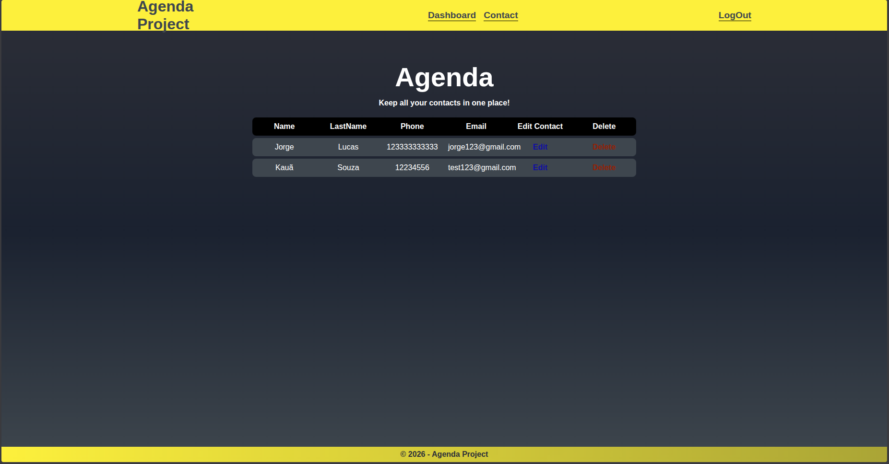
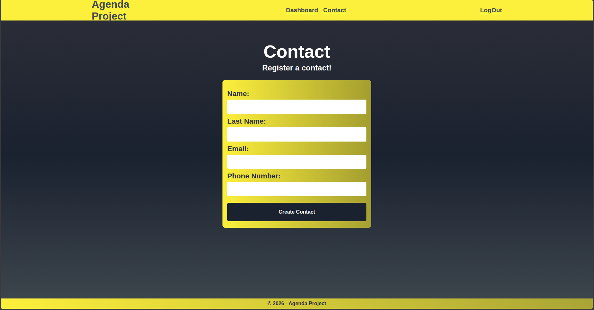
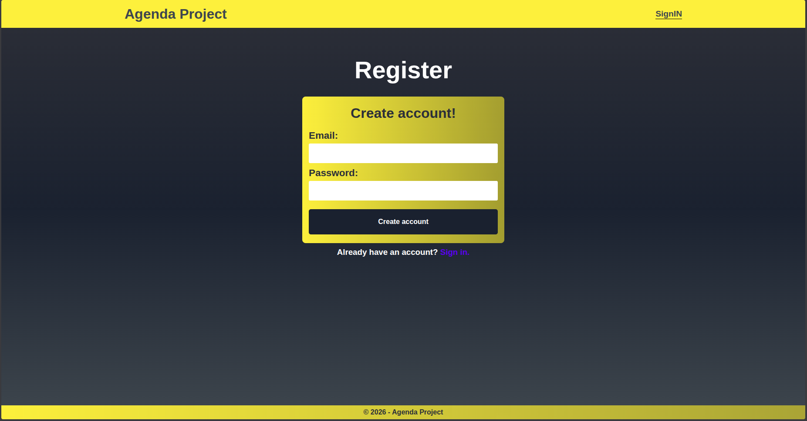
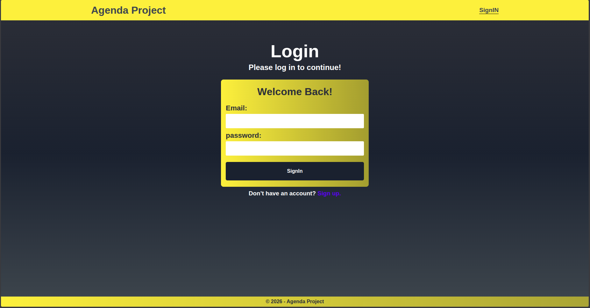
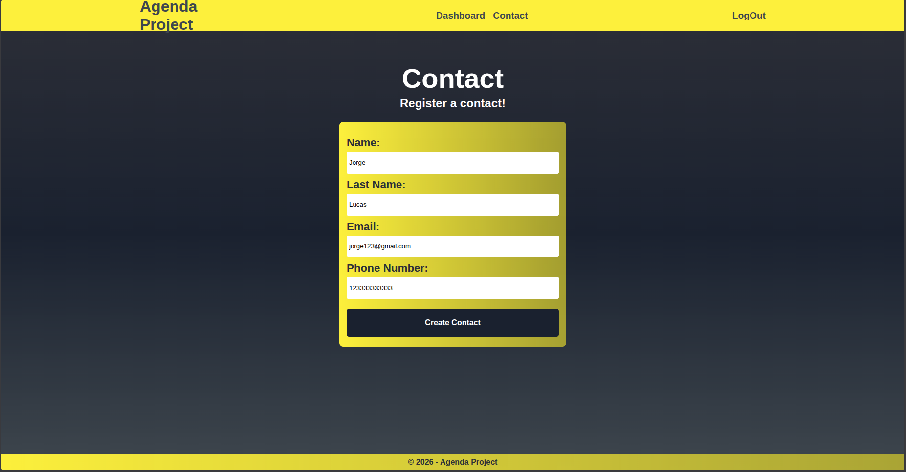

# 🧠 Project Title: Agenda Project

The Agenda Project is a comprehensive web application designed to manage user accounts, contacts, and agendas. It provides a secure and efficient way to handle user registration, login, and authentication, as well as contact and agenda management. The system is built using a robust tech stack, including Express.js, Mongoose, and Webpack, ensuring a scalable and maintainable architecture.

## 🚀 Features

The User Management System offers the following key features:

- User registration and login functionality with authentication and authorization
- Contact management, including creating, reading, updating, and deleting contacts
- Agenda management, including creating, reading, updating, and deleting agenda items
- Secure password hashing and verification using bcryptjs
- CSRF protection using csurf
- Session management using Express Session and Connect Mongo
- Error handling and logging using global middleware functions
- Form validation and feedback using frontend JavaScript classes

## 🛠️ Tech Stack

The User Management System is built using the following technologies:

- Express.js: A popular Node.js web framework for building web applications
- Mongoose: A MongoDB object modeling tool for interacting with the database
- Webpack: A JavaScript module bundler and build tool for managing frontend code
- Babel: A JavaScript transpiler for converting modern JavaScript code to older syntax
- CSS: A styling language for designing the user interface
- EJS: A templating engine for rendering dynamic HTML templates
- Helmet: A security middleware for protecting against common web vulnerabilities
- csurf: A CSRF protection middleware for preventing cross-site request forgery attacks
- Express Session: A session management middleware for storing user data
- Connect Mongo: A MongoDB session store for persisting session data
- bcryptjs: A password hashing and verification library for securing user passwords

## 📦 Installation

To install the User Management System, follow these steps:

1. Clone the repository using `git clone`
2. Install the dependencies using `npm install`
3. Start the development server using `npm run dev`
4. Access the application at `http://localhost:3000`

## 💻 Usage

To use the User Management System, follow these steps:

1. Register a new user account by filling out the registration form
2. Log in to the application using the registered credentials
3. Manage contacts and agendas using the provided functionality
4. Log out of the application when finished

## 📂 Project Structure

```markdown
.
├── frontend
│ ├── main.js
│ ├── assets
| | ├── css
│ └── modules
├── src
│ ├── controllers
│ │ ├── contactController.js
│ │ ├── homeController.js
│ │ ├── loginController.js
│ │ ├── registerController.js
│ │ └── ...
│ ├── middlewares
│ │ ├── isAuthenticated.js
│ │ ├── globalMiddlewares.js
│ │ └── ...
│ ├── models
│ │ ├── contactModel.js
│ │ ├── LoginModel.js
│ │ ├── AgendaModel.js
│ │ ├── RegisterModel.js
│ │ └── ...
│ ├── routes
│ │ ├── routes.js
│ │ └── ...
│ ├── server.js
│ └── ...
├── package.json
├── webpack.config.js
└── ...
```

## 📸 Screenshots






